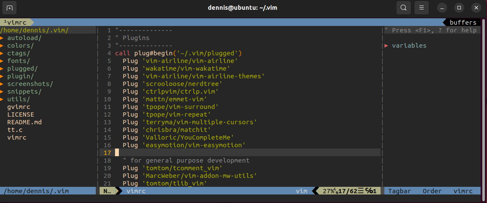

# 專案介紹 : 我的vim環境設定檔

## 寫程式需要滑鼠嗎？

## 初衷

>一旦你意識到Vim的強大，你就踏上了不停發掘它們潛力的漫漫長路。你不停地改進自己的檔案，你不停地搜尋更好的插件，甚至有一天你開始動手寫自己的插件。 就像劍客保養自己的劍一樣，你也甘心花時間提升你的Vim。經年累月，不知不覺，你已經在那把劍上傾注了你的靈魂。用Vim就像吸食毒品，慢慢地就會上癮。它們會帶給你漸漸強烈的快感，但你也向它們獻出了自己的靈魂。這時，你只能稱它們為神器。

## 運行環境

* ubuntu 22.04
* vim 8.2

## 我的設定檔

目前它看起來是這樣,使用配色（gruvbox）

### 快捷鍵設定

* F2 啟動/關閉 NERDTree 視窗
* F3 啟動/關閉 Tagbar 視窗
* F5 執行程式 （Python）
* Leader key = " "

## 使用套件

### 外掛管理

* VimPlug <https://github.com/junegunn/vim-plug>

### 編輯器功能加強

* NERDTree <https://github.com/scrooloose/nerdtree>
* ctrlP <https://github.com/ctrlpvim/ctrlp.vim>
* vim-airline <https://github.com/vim-airline/vim-airline>
* vim-airline-themes <https://github.com/vim-airline/vim-airline-themes>
* surround <https://github.com/tpope/vim-surround>
* repeat <https://github.com/tpope/vim-repeat>
* rainbow <https://github.com/luochen1990/rainbow>
* vim-gitgutter <https://github.com/airblade/vim-gitgutter>
* youCompleteMe <https://github.com/ycm-core/YouCompleteMe>

### 一般開發

* Emmet <https://github.com/mattn/emmet-vim>
* tComment <https://github.com/tomtom/tcomment_vim>
* SnipMate <https://github.com/garbas/vim-snipmate>
* vim-snippets <https://github.com/honza/vim-snippets>
* tagbar <https://github.com/majutsushi/tagbar>
* ack <https://github.com/mileszs/ack.vim>

### 配色

* Gruvbox <https://github.com/morhetz/gruvbox>
* Molokai <https://github.com/tomasr/molokai>
* Wombat256 <https://github.com/vim-scripts/wombat256.vim>

### 字型

* power-line-font <https://github.com/powerline/fonts>
